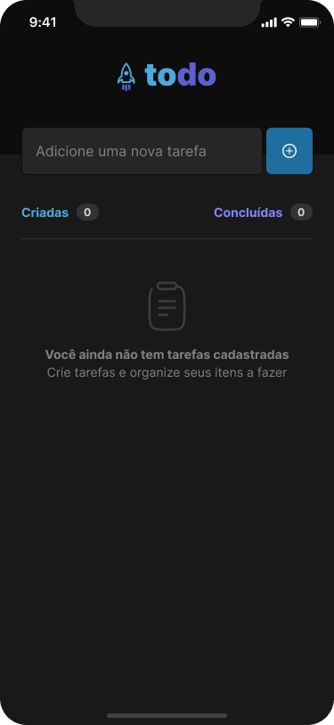
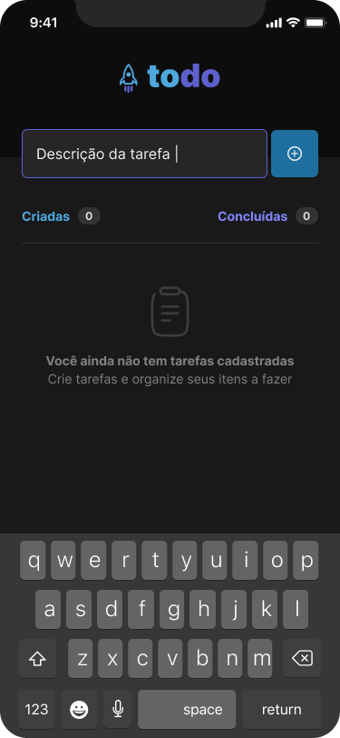
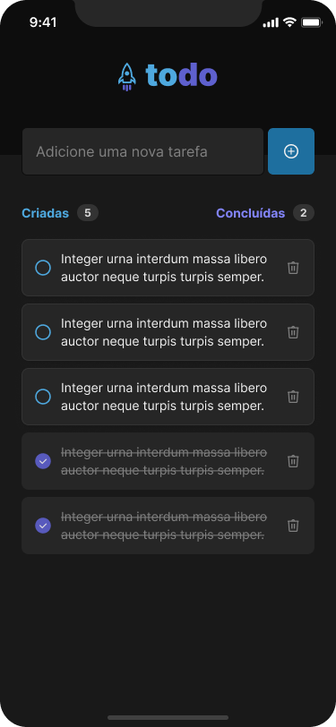
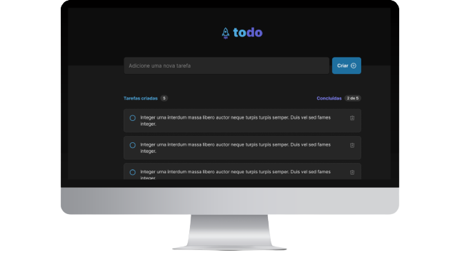

<h1 align="center">
  
</h1>

<br>

<h4 align="center">

    🚧 ToDo List ✔️
    🚧 Em Desenvolvimento 🔨
</h4>

<br>

## 💻 Sobre o projeto
O app ToDo List ✔️ surgiu com o propósito de ajudar pessoas a se organizarem em seus afazeres do dia a dia utilizando o sistema prático de adicionar e remover tarefas em formato de checklist.

---
<br>

## ⚙️ Funcionalidades
- [ ] adicionar uma nova tarefa
- [ ] marcar e desmarcar uma tarefa como concluída
- [ ] remover uma tarefa da listagem
- [ ] mostrar o progresso de conclusão das tarefas

---
<br>

## 🎨 Layout

### Mobile
<div align="center">
  
  
  
</div>

### Web
<div align="center">
  
</div>

---
<br>

## 🚀 Como executar o projeto

### Pré-requisitos
Para executar o projeto você irá precisar ter instalado algumas ferramentas em sua máquina:
[Git](https://git-scm.com/), [Node.js](https://nodejs.org/)

### 📱 Rodando a aplicação Mobile
```bash
# Clone este repositório
$ git clone https://github.com/thegabrielrodrigues/todo-list.git

# Acesse a pasta do projeto
$ cd todo-list/mobile

# Instale o yarn caso não esteja instalado
$ npm install -g yarn

# Instale as dependências
$ yarn install

# Execute a aplicação
$ yarn start
```

### 🧭 Rodando a aplicação Web
```bash
# Clone este repositório
$ git clone https://github.com/thegabrielrodrigues/todo-list.git

# Acesse a pasta do projeto
$ cd todo-list/web

# Instale o yarn caso não esteja instalado
$ npm install -g yarn

# Instale as dependências
$ yarn install

# Execute a aplicação
$ yarn run dev
```
